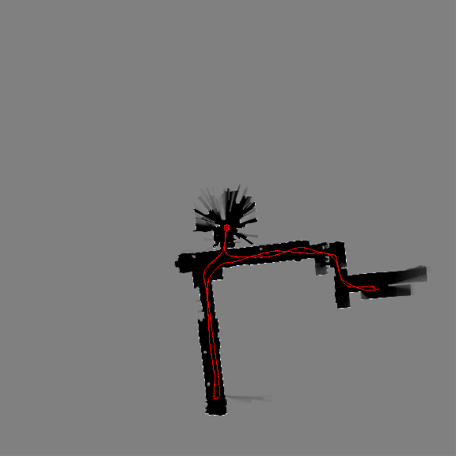

matlab_slam
===========

Scan-matching / Particle Filter SLAM from ESE650 




to initialize workspace
```
$ initws 
```
to run a test
```
$ res = run_test( test_num )
```
to post process the data ... after running *run_test*:
```
$ post_process
```
to post process data using kinect 
```
$ load kinect"test_num"
$ post_process_kinect
```
